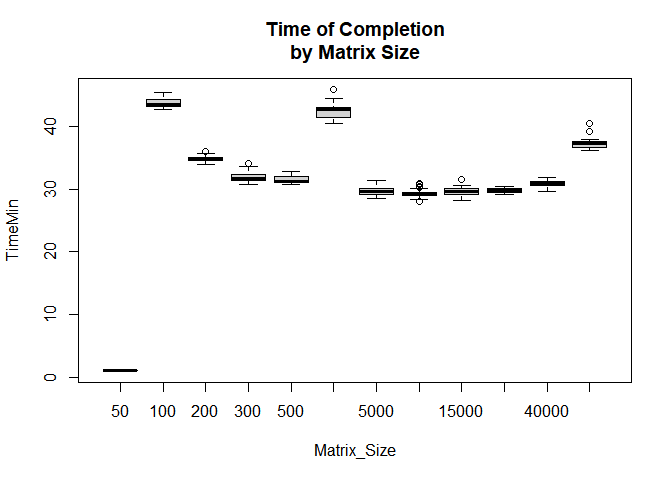

Sparse Matrix Efficiency Experimentation
================
Abraham B.
7/1/2019

## TURF Analysis:

[Turf
Analysis](https://www.questionpro.com/article/turf-analysis.html#:~:text=TURF%20Analysis%20or%20Total%20Unduplicated,how%20often%20does%20that%20happen)
is a common type of tool use among marketers to identify the most
effective way to reach the largest audience. The link above does a great
job at explaining in detail the methodology.

A big computational problem comes when a user wants to identify the most
efficient way by which that large audience can be captured. There are
heuristics that can provide that level of insight, but those heuristics
often times end up in local optima, which is usually good enough\! The
only solution that guarantees the best mathematical configuration is to
test every possible combination of features.

## Method:

One way to tackle this is to set every configuration and run a loop
through each of them, ideally in parallel. However, each test has a
fixed computational cost that makes this approach unfeasible when the
search space is large (in the millions or hundreds of millions).
Ideally, all configurations could be tested at once using linear algebra
(matrix multiplication), but this appraoch is prohibited by the amount
of RAM on a computer.

A good compromise is to chunk that matrix and test each chunk
individually (that is, we are NOT testing one configuration at a time,
norw all configurations at once). But the question is, how large should
that chunk be? Is it better to have larger but fewer chunks, or smaller
but more chunks? Or maybe there’s an optimal configuration.

I will test different chunk sizes using sparse matrices to identify the
optimal size of chunk that yields the most efficient run.

``` r
  ## Load libraries
  library(turfR)
  library(caret)
  library(tcltk)
  library(parallel)
  library(foreach)
  library(doParallel)
  library(Matrix)

RespondentSheet <- read.csv("C:/Users/abbal/Documents/LRW - Best Combos Turf/Respondent_ForOptimization.csv")
BinarySheet <- read.csv("C:/Users/abbal/Documents/LRW - Best Combos Turf/Binary_ForOptimization.csv")

ItemNames <- paste0("Item", sprintf("%03d", 1:30))
```

Function for optimization

``` r
TURF_Optimization<- function(BinarySheet = BinarySheet, 
                              RespondentSheet = RespondentSheet, 
                              ItemNames = ItemNames, 
                              OptimizationSequence=6, 
                              WSname = "W1", 
                              FoldSize=Sizes[i],
                              FixItems = NULL,
                              OutputFixedItems=F){
  
  ####################
  ## Begin Function ##
  ####################
  
  ## Get number of items and subgroups
  SubgroupNames <- names(RespondentSheet)[3:dim(RespondentSheet)[2]]
  ItemCount <- length(ItemNames)
  
  ## Set up data. MAke sure it's aligned by Serial
  if(dim(BinarySheet)[1]!=dim(RespondentSheet)[1]) stop("The number of rows for both files differ. Check that they match.")
  
  names(BinarySheet)[1] <- "Respondent_Serial"; names(RespondentSheet)[1] <- "Respondent_Serial"
  WeightVarName <- names(RespondentSheet)[2]
  
  MergedData <- merge(BinarySheet, RespondentSheet)
  
  BinaryData <- MergedData[, c("Respondent_Serial",WeightVarName, names(BinarySheet)[-1])]
  
  ## Multiply binary data by weight value
  for (i in 1:nrow(BinaryData)){
    BinaryData[i,-c(1,2)] <- BinaryData[i,-c(1,2)] * BinaryData[i, 2]
  }
  
  RespData <- MergedData[,names(RespondentSheet)]
  
  ## To store results
  ListOfOpts <- list()
  
  ## Create progress bar
  pb <- txtProgressBar(min = 0, max = length(SubgroupNames)*length(OptimizationSequence), style = 3)
  
  for (sgr in 1:length(SubgroupNames)){
    
    SubsetBinary = BinaryData[RespData[,SubgroupNames[sgr]]==1, ]
    SubsetWeights = RespondentSheet[RespData[,SubgroupNames[sgr]]==1, WeightVarName]
    BinaryData_Sparse <- as.matrix(SubsetBinary[, -c(1,2)])
    
    ################################################
    ## Begin optimization for each sequence value ##
    ################################################
    
    for (sqnc in OptimizationSequence){
      
      cat(paste("\n","Subgroup: ", SubgroupNames[sgr],". Number of items in optimization: ", sqnc, ".", sep =""))
      
      
      ## Set up the matrix needed to enter the turfR function
      if (is.null(FixItems)){
        FreeItemCount <- ItemCount
        FullCombosMatrix <- turf.combos(n = FreeItemCount, k = sqnc)[[1]]
        names(FullCombosMatrix) <- ItemNames
        FullCombosMatrix <- Matrix(as.matrix(FullCombosMatrix, sparse = TRUE))
      } else {
        ## Create the combination matrix for the free items, and another for the fixed items. Combine them both so
        ## that the fixed columns (all 1s) are placed in the right position
        FreeItemCount <- ItemCount - length(FixItems)
        VariableCombosMatrix <- turf.combos(n = FreeItemCount, k = sqnc)[[1]]
        FixedCombosMatrix <- matrix(1, nrow = dim(VariableCombosMatrix)[1], ncol = length(FixItems))
        
        colnames(VariableCombosMatrix) <- ItemNames[-c(FixItems)]
        colnames(FixedCombosMatrix) <- ItemNames[c(FixItems)]
        
        MergedCombosMatrix <- cbind(VariableCombosMatrix, FixedCombosMatrix)
        
        FullCombosMatrix <- MergedCombosMatrix[,ItemNames]
      }
      ## Great success!
      
      ########################################################
      ## Split the matrix into pieces for optimization run  ##
      ########################################################
      
      NumberFolds <- ceiling(x = dim(FullCombosMatrix)[1]/FoldSize)
      Folds <- createFolds(y = 1:dim(FullCombosMatrix)[1], k = NumberFolds)
      
      #######################################################
      ## Optimization steps                                ##
      #######################################################
      
      ## Parallelization
      Ncores <- detectCores()
      cl <- makeCluster(Ncores)
      registerDoParallel(cl)
      
      ## Optimize
      CurrTurfTable <- foreach(fld=1:length(Folds), .combine = rbind) %dopar% {
        
        # library(turfR)
        # ListCombos <- list(FullCombosMatrix[Folds[[fld]],])
        # invisible(capture.output(CurrTurf <- turf(SubsetBinary, n = ItemCount, k = sqnc+length(FixItems), mc = F, nsims = dim(SubsetBinary)[1], combos = ListCombos)))
        # Result <- CurrTurf$turf[[1]]
        library(Matrix)
        
        ## Convert to SPARSE MATRIX
        ListCombos <- list(FullCombosMatrix[Folds[[fld]],])
        Mat_Multiplied <- ListCombos[[1]] %*% t(BinaryData_Sparse)
        
        rchX = apply(Mat_Multiplied, 1, function(x) sum(SubsetWeights[x>0]) /  sum(SubsetWeights))
        frqX = apply(Mat_Multiplied, 1, function(x) mean(x))
        hits = (frqX / rchX)
        
        Collapsed_Item_Names = t(apply(ListCombos[[1]], 1, function(x) ItemNames[which(x==1)]))
        
        ToReturn <- cbind(rchX, hits, frqX, Collapsed_Item_Names)
        
      }
      suppressWarnings(stopCluster(cl))
      
      ##########################################
      ## Take results and store them properly ##
      ##########################################
      
      if(is.null(FixItems) || OutputFixedItems==T){
        Slots4Names <- sqnc
        Columns2Remove <- NULL
      }
      
      if(!is.null(FixItems) && OutputFixedItems==F){
        Slots4Names <- sqnc
        Columns2Remove <- FixItems+3
      }
      
      #TURFING DONE#
      OutputTable <- as.data.frame(matrix(nrow = dim(CurrTurfTable)[1], 
                                          ncol = 6))
      
      ## Add reach, freq, freq by 100
      OutputTable[,c(4)] <-  as.numeric(CurrTurfTable[,c("rchX")])
      OutputTable[,c(5)] <-  as.numeric(CurrTurfTable[,c("hits")])
      OutputTable[,c(6)] <-  as.numeric(CurrTurfTable[,c("frqX")]) * 100
      
      OutputTable[ ,1] <- rank(-OutputTable[, 4], ties.method = "first")
      OutputTable[ ,2] <- rank(-OutputTable[, 5], ties.method = "first")
      OutputTable[ ,3] <- rank(-OutputTable[, 6], ties.method = "first")
      
      ## Shorten the output table to only the top 500 for each metric
      Top500Reach <- which(OutputTable[ ,1]<=500)
      Top500Freq <-  which(OutputTable[ ,2]<=500)
      Top500Hits <-  which(OutputTable[ ,3]<=500)
      
      Cases2Keep <- unique(c(Top500Reach, Top500Freq, Top500Hits))
      
      OutputTable <- OutputTable[Cases2Keep, ]
      
      ## Add names and labels
      if(!is.null(FixItems) && OutputFixedItems==F) CurrTurfTable <- CurrTurfTable[,-Columns2Remove]
      
      OutputTable <- cbind(OutputTable, CurrTurfTable[Cases2Keep, -c(1:3)])
      names(OutputTable)[1:6] <- c("Rank: reach", "Rank: Freq", "Rank: Hits", "Reach", "Freq", "Hits") 
      ObjectName <- paste(WSname, "R1", "G",sgr,"C",sqnc, sep = "")
      
      ############
      ## Output ##
      ############
      
      ListOfOpts[[ObjectName]] <- OutputTable
      
      ## Display progress bar and clean up memory
      currVal <- (((sgr - 1)*(length(OptimizationSequence)) + (sqnc - min(OptimizationSequence) + 1)))
      setTxtProgressBar(pb, currVal)
      suppressWarnings(gc())
      
      ## Next Sequence
    } 
    ## Next Subgroup
  }
  return(ListOfOpts)
}
```

Let’s test a variety of sizes, ranging from 50 up to 100,000. I have
64gb of RAM, which should be able to handle that large matrix.

``` r
## Let's see how size affects performance
Sizes <- rep(c(50, 100, 200, 300, 500, 1000, 5000, 10000,15000, 20000, 40000, 100000),25)

TimeMin <- c()

for (i in 1:length(Sizes)){
  Before_Time <- Sys.time()
  BestCombos <- TURF_Optimization(BinarySheet = BinarySheet, 
                                                    RespondentSheet = RespondentSheet, 
                                                    ItemNames = ItemNames, 
                                                    OptimizationSequence=6, FoldSize = Sizes[i])
  Length_Time <- Sys.time() - Before_Time
  
  TimeMin[i] <- c(Length_Time)

}
```

``` r
Results <- as.data.frame(cbind(Matrix_Size = Sizes, TimeMin))
boxplot(TimeMin~Matrix_Size,data=Results, main = "Time of Completion\nby Matrix Size")
```



Where is the optimal solution?
